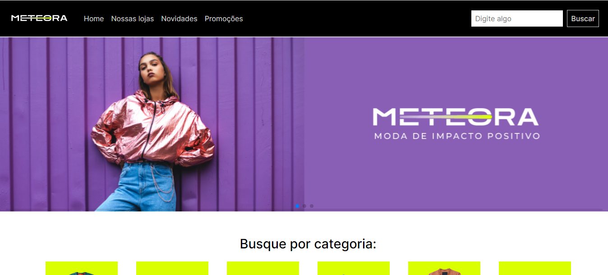
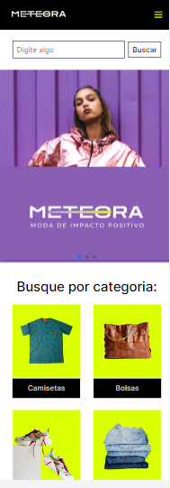
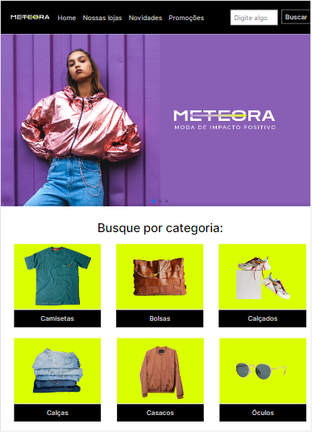
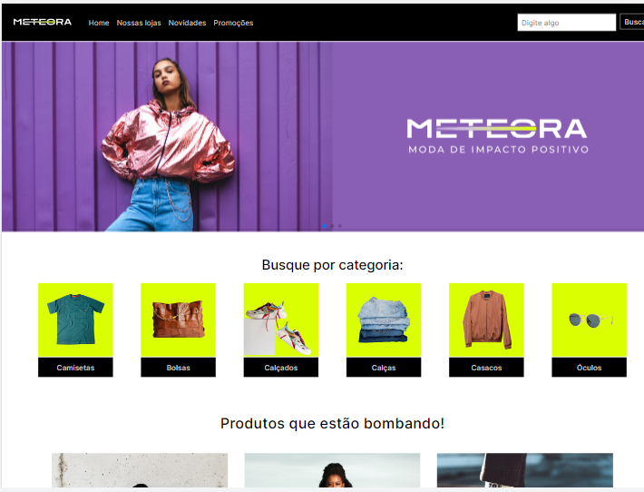

  
# Alura Challenge Front-end 7 edição

 O desafio propõe criar a página da Meteora, um ecommerce de roupas casuais e para todos os gêneros. E é uma empresa
que busca sempre o que a de novo na moda, agora busca alcançar o mercado digital criando uma plataforma online de 
vendas para os seus produtos.

| :placard: Vitrine.Dev |  [Minha Vitrine Dev](https://cursos.alura.com.br/vitrinedev/marioapereirar)   |
| -------------  | --- |
| :sparkles: Nome        | **Meteora**
| :label: Tecnologias |   
| 🎇: Bibliotecas | [Bootstrap](https://getbootstrap.com/), [SwiperApi](https://swiperjs.com/).
| :rocket: URL         | [Projeto](https://meteora-rosy.vercel.app/)
| :fire: Desafio     | [Conheça o Challenge Alura](https://www.alura.com.br/challenges/front-end-6?host=https://cursos.alura.com.br)
| :page_with_curl: Licença         |  
  

# 💪 Sobre o Challenge da Alura

É um desafio de Frontend proposto pela escola de tecnologia Alura, onde recebemos um layout completo da página no
Figma e passos para seguir na plataforma do Trello, e que foram divididos em um período de **4 semanas**.

## Objetivo

Ao final desse desafio teremos eses conteudos prontos:

- Uma página inicial que contenha um buscador de produtos oferecidos pela empresa;
- Um banner/carrossel que contenha informações sobre a coleção do momento;
- Uma galeria com as categorias dos produtos disponíveis na loja;
- Uma galeria com as informações dos produtos, como: imagem, nome do produto, descrição e link que leva até a página de “Saiba mais sobre o produto”.
- Uma modal que contenha a imagem, o nome, a descrição, o preço, as variações do produto e a opção de adicionar na sacola;
- Uma seção para divulgar as facilidades que a loja proporciona para realizar as compras;
- Uma seção para cadastrar na newsletter e receber novidades;
- Um rodapé com informação do site.

# :one: Primeira Semana | **:white_check_mark: Feito**

Esses são os meus objetivos da semana: 

- :white_check_mark: Passo 1 | Cabeçalho 
- :white_check_mark: Passo 2 | Cabecalho Responsividade
- :white_check_mark: Passo 3 | Banner 
- :white_check_mark: Passo 4 | Seção "Busque por categorias"
- :white_check_mark: Passo 5 | Seção "Facilidades"
- :white_check_mark: Passo 6 | Seção "Produtos"
- :white_check_mark: Passo 7 | Seções "Responsividade"

## Resultados da primeira semana:

## Resumo da semana:

Na primeira semana não tive tantos desafios, já que nós tínhamos que fazer apenas o  HTML e CSS. E essas são áreas
das quais eu já me dou bem. Eu optei em começar o projeto usando o método de MobileFirst por achar que depois a 
responsividade seria mais tranquila de fazer.

# :two: Segunda Semana **:white_check_mark: Feito**

Esses são os meus objetivos da semana: 

- :white_check_mark: Passo 1 | Rodapé
- :white_check_mark: Passo 2 | Cadastro na Newsletter
- :white_check_mark: Passo 3 | Carrosel
- :white_check_mark: Passo 4 | Modal - Produtos
- :white_check_mark: Passo 5 | Modal - Produtos responsividade
- :white_check_mark: Passo 6 | Modal - Newslatter

## Resumo da semana: 

Na segunda semana foram feitos os modais, tanto dos produtos quanto do Newsletter. E aqui eu tive meu primeiro 
desafio, porque foi a primeira vez que eu fiz um modal ou um elemento HTML que sumir e fechar na tela, e com um artigo 
que a própria Alura disponibilizou eu acabei descobrindo a tag <dialog>, que é usada exatamente para esse tipo de 
situação. E no final acabei conseguindo fazer todos os passos dentro do prazo da semana.

# :three: e :four: Terceira e quarta semana  **:white_check_mark: Feito**

Esses são os meus objetivos da semana: 

- :white_check_mark: Passo 1 | Galeria de Produtos - Listagem via API
- :white_check_mark: Passo 2 | Galeria de Produtos - Filtrar por categoria
- :white_check_mark: Passo 3 | Galeria de Produtos - Filtrar por barra de pesquisa
- :white_check_mark: Passo 4 | Modal de Produtos - Abrir / Fechar
- :white_check_mark: Passo 5 | Modal de Newsletter - Abrir / Fechar
- :white_check_mark: Passo 6 | Cadastro Newsletter - Validação

##  Resumo da semana:

Na terceira e quarta semanas foram feitas a parte lógica da página. Nos primeiros 3 passos das semanas, eu me sai bem, 
porque eram conteúdos dos quais eu tinha acabado de estudar e tava colocando em prática como simular e tratar uma API 
e fazer funções assincronas para manipular o DOM. No entanto, nos próximos passos eu tive um sério problema, 
principalmente na hora de fazer a função de abrir e fechar os modais, passei um bom tempo tentando de várias formas, 
até pedi ajuda a amigos da área. E por fim lendo alguns artigos sobre, eu optei por usar a biblioteca do Bootstrap que 
já tem uma variedade de modais já prontos para usar e implementar no projeto. E assim consegui concluir o desafio

# 🤯 Minha experiência

Esse foi o primeiro desafio de Frontend da Alura em que eu participei, e tive uma experiência incrível sobre muitas
coisas. 

Com esse desafio eu pude colocar em prática os conhecimentos que consegui nos cursos da Alura, e pude ver uma melhoria 
nas minhas habilidades, mesmo sabendo que ainda não cheguei onde quero, sinto que estou melhor.

E graças ao desafio eu comecei a interagir mais com as pessoas da área, até na comunidade do próprio desafio. O que 
antes era um verdadeiro desafio para mim, acabou que consegui conversar bem com as pessoas e até ajudar algumas.

Estou satisfeito com a minha primeira participação em um desafio de desenvolvimento, terminei ele consolidando alguns 
conhecimentos e aprendendo coisas novas, consegui interagir com algumas pessoas e superei esse desafio. Pretendo 
participar dos próximos com toda certeza, sei que ainda não estou no meu melhor e posso melhorar bem mais esse código 
que fiz e pretendo fazer isso.

## ⭐ Representação do projeto em diversas telas

# 🙋‍♂️ Autor

Mário Anthony Pereira Rocha

Acesse minha redes [aqui](https://social-links-v2.bohr.io/)
